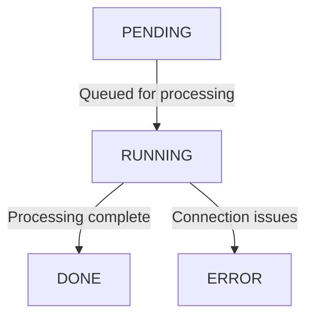

## Overview

The **Scan** object represents a comprehensive view of a scanned webpage, including metadata, status, and other relevant attributes. This page details the scan lifecycle and attributes, both for newly created scans and completed scan results.

## Scan Lifecycle

When a new scan is created, it follows these status transitions:



* **PENDING**: The scan is waiting in the queue.

* **RUNNING**: The scan is being processed.

* **DONE**: The scan has completed successfully, and all attributes are available.

* **ERROR**: There was a connection issue, preventing the scan from completing.

## New Scan

When creating a new scan, several attributes can be configured to customize the scanning process:

### Attributes

* **Scanned From**: Specifies the list of countries from which the scan is performed. By default, scans originate from the **DEFAULT** country unless a premium option is selected.&#x20;

  <Warning>Available only for PREMIUM users.</Warning>

* **Visibility**: Determines who can view the scan results. Options include:
  -Public: The scan is visible to all users.
  -Private: The scan is visible only to the creator&#x20;

  <Info>available only for authenticated users.</Info>

* **Device**: Determines whether the scan is performed using a ```MOBILE``` or ```DESKTOP``` device.

* **User Agent**: The user agent string used for the scan. The available options depend on the selected device type.

* **Viewport**: The screen dimensions used for rendering the page. The available options vary based on the selected device and affect the screenshot size.

* **Waiting Time**: Defines how long to wait before scraping data, allowing pages with dynamic content to fully load before capture.