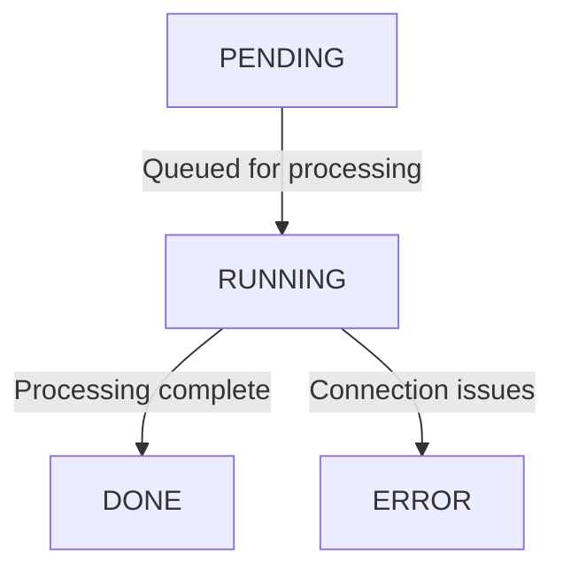

## Overview

The **Scan** object represents a comprehensive view of a scanned webpage, including metadata, status, and other relevant attributes. This page details the scan lifecycle and attributes, both for newly created scans and completed scan results.

## Scan Lifecycle

When a new scan is created, it follows these status transitions:

* **PENDING**: The scan is waiting in the queue.

* **RUNNING**: The scan is being processed.

* **DONE**: The scan has completed successfully, and all attributes are available.

* **ERROR**: There was a connection issue, preventing the scan from completing.