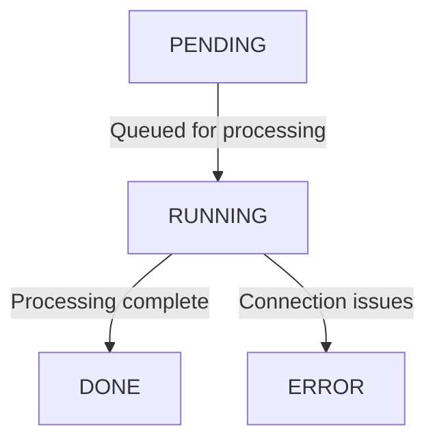

## Overview

The **Scan** object represents a comprehensive view of a scanned webpage, including metadata, status, and other relevant attributes. This page details the scan lifecycle and attributes, both for newly created scans and completed scan results.

## Scan Lifecycle

When a new scan is created, it follows these status transitions:

* **PENDING**: The scan is waiting in the queue.

* **RUNNING**: The scan is being processed.

* **DONE**: The scan has completed successfully, and all attributes are available.

* **ERROR**: There was a connection issue, preventing the scan from completing.

## New Scan

When creating a new scan, several attributes can be configured to customize the scanning process:

* **Submitted URL**: The URL to be scanned must be a valid and properly formatted URL. If no protocol (e.g., `http://` or `https://`) is provided, the system will automatically assume `https://`.

* **Scanned From**: Specifies the list of countries from which the scan is performed. By default, scans originate from the **DEFAULT** country unless a premium option is selected.

  <Warning>Available only for PREMIUM users.</Warning>

* **Visibility**: Determines who can view the scan results. Options include:

  * **Public**: The scan is visible to all users.

  * **Private**: The scan is visible only to the creator (available only for authenticated users).

<Info>Available only for authenticated users.</Info>

* **Device**: Determines whether the scan is performed using a **mobile** or **desktop** device.

* **User Agent**: The user agent string used for the scan. The available options depend on the selected device type.

* **Viewport**: The screen dimensions used for rendering the page. The available options vary based on the selected device and affect the screenshot size.

* **Waiting Time**: Defines how long to wait before scraping data, allowing pages with dynamic content to fully load before capture.

## Show Scan

When viewing a completed scan, various attributes and details are available to provide insights into the scanned webpage.

* **Scan Info**: General information related to the scan.

* **Scan Classification**: Determines if the scan is malicious, as detected by the custom urlDNA AI Engine.

  <Tip>AI Features</Tip>

* **IP Address**: The IP address associated with the scanned webpage.

* **Certificate**: Information about the site's SSL/TLS certificate.

* **HTTP Transactions**: Captures HTTP request and response headers.

* **Headers**: Extracted HTTP headers from the response.

* **Meta Tags**: Extracted metadata from the webpage.

* **Screenshot**: A snapshot of the scanned page for visual reference.

* **urlDNA AI**: Advanced attributes generated by the custom state-of-the-art AI engine, including:

  * Page language detection

  * Category and topic classification

  * NSFW content detection

    <Tip>AI Features</Tip>

* **Page Info**: Includes details such as favicon, title, and extracted text from the page.

* **Outgoing Links**: List of external links found on the page.

* **Technologies**: Detection of technologies used by the webpage, such as frameworks and libraries.

* **Cookies**: Captured cookies set by the page.

* **DOM**: Analysis of the Document Object Model (DOM) structure.

The main attributes in the scan page are searchable by clicking the hand lens (search) icon.

## Scan Feedback

<Info>Available only for authenticated users.</Info>
All authenticated users can send scan classification feedback by clicking **'Mark as Malicious'** to indicate that a scan is malicious or phishing, or **'Mark as Safe'** to confirm that a scan is safe.

All feedback is welcomed as it helps our urlDNA Engine improve performance and accuracy.

## Bulk Scan

<Warning>Available only for PREMIUM users.</Warning>

Bulk scanning is available only to **premium users**. It includes all the attributes of a new scan but allows submitting up to **50 URLs at a time**.

## General Advertisement

<Warning>AI-generated attributes may contain inaccuracies as we continuously improve our model.</Warning>

If you wish to remove a scan, need insights or explanations, or have any doubts about the results, please fill out the [Contact Us](https://urldna.io/contact-us) form.