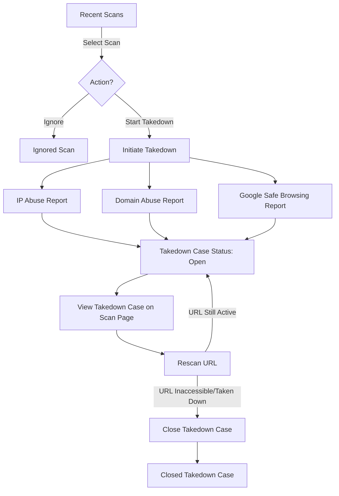

<Warning>Available only for PREMIUM users.</Warning>

## Overview
The urlDNA Takedown feature is available exclusively to premium users. It allows them to manage and initiate takedown requests for phishing and abusive websites related to their brands. Premium users have access to the **Takedown Manager**, which provides visibility into scans associated with their brands that are not currently part of a takedown case.

## Takedown Workflow

## Takedown Manager
The **Takedown Manager** enables premium users to:
- View scans matching their related brands
- Identify scans not yet included in a takedown case
- Take action on scans by either starting a takedown case or ignoring them

### Tabs in the Takedown Manager:
1. **Recent Scans** – Displays all recent scans matching the brand that are not part of a takedown case or have been ignored.
2. **Open Cases** – Lists all takedown cases that are currently in progress.
3. **Closed Takedowns** – Shows all takedown cases that have been successfully completed.
4. **Ignored Cases** – Contains scans that the user has chosen to ignore.

## Takedown Process
### Step 1: Identifying a Scan for Takedown
- Users can select a scan from the **Recent Scans** tab.
- The scan can either be **ignored** or used to **initiate a takedown case**.

### Step 2: Initiating a Takedown Case
- Once a takedown case is started, the user must complete the following steps:
  1. **Send an email or fill out a form for IP Abuse reporting**
  2. **Send an email or fill out a form for Domain Abuse reporting**
  3. **Report the URL to Google Safe Browsing**
- After completing these steps, the takedown case status is set to **Open**.

### Step 3: Monitoring and Managing Open Cases
- On the **Scan Page**, users can view:
  - Takedown details
  - Live Google Safe Browsing classification status
  - Number of scans (matched by URL) affected by the takedown
- Users can rescan the URL to check its accessibility.

### Step 4: Closing a Takedown Case
- If the rescanned URL is inaccessible or taken down, the user can mark the takedown case as **Closed**.

## Conclusion
The urlDNA Takedown feature streamlines the process of reporting and mitigating phishing threats. By leveraging the **Takedown Manager**, premium users can efficiently track, manage, and close takedown cases, enhancing brand protection.

